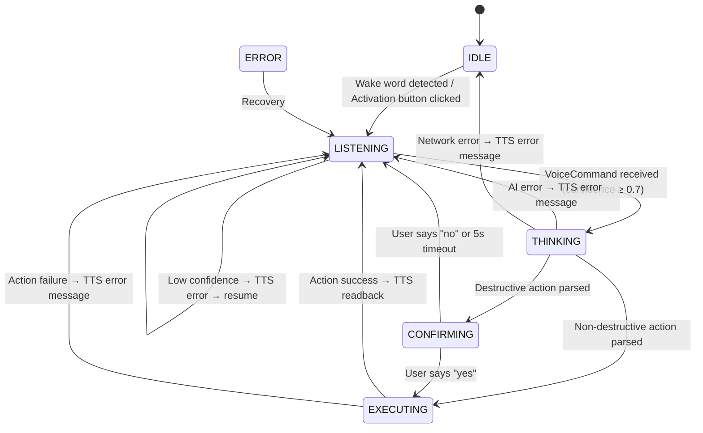
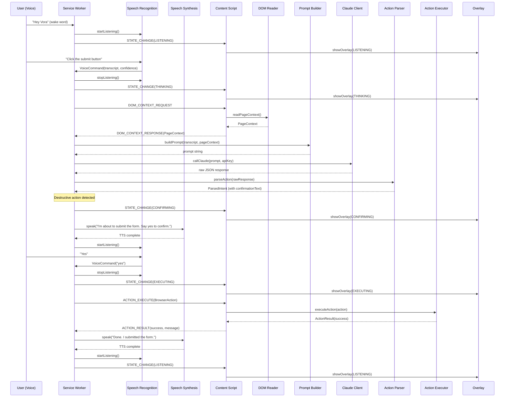

# Design Document — Vora Voice Browser Control

## Overview

Vora is a Chrome Extension (Manifest V3) that replaces the mouse and keyboard with voice as the sole input method for web browsing. The system captures natural language voice commands, reads the current page DOM for context, sends both to the Anthropic Claude API for intent parsing, and executes the resulting browser action on the live page — all coordinated through a state machine in the background service worker.

The architecture spans four Chrome extension contexts:

1. **Background (Service Worker)** — owns the global state machine, orchestrates the command pipeline, and acts as the Chrome message passing hub
2. **Content Script** — injected into every page; reads the DOM, executes actions, and renders a Shadow DOM overlay for visual feedback
3. **Popup (React)** — displays status, command history, settings, and an activation button
4. **AI Pipeline** — pure TypeScript modules for prompt construction, Claude API communication, and response parsing

The design prioritizes accessibility: every state transition produces TTS audio feedback, destructive actions require voice confirmation, and the extension is fully operable without a mouse or keyboard after initial activation.

## Architecture

### System Architecture Diagram

```mermaid
graph TB
    subgraph "Chrome Extension Contexts"
        subgraph "Background Service Worker"
            SW[service-worker.ts<br/>State Machine + Orchestrator]
        end

        subgraph "Content Script (per tab)"
            CS[index.ts<br/>Message Router]
            DR[domReader.ts<br/>DOM Extraction]
            AE[actionExecutor.ts<br/>DOM Manipulation]
            OV[overlay.ts<br/>Shadow DOM Overlay]
        end

        subgraph "Popup (React)"
            APP[App.tsx]
            SI[StatusIndicator]
            AB[ActivationButton]
            CH[CommandHistory]
            SP[SettingsPanel]
            HVS[useVoiceState]
            HCH[useCommandHistory]
        end

        subgraph "AI Pipeline (pure modules)"
            PB[promptBuilder.ts]
            CC[claudeClient.ts]
            AP[actionParser.ts]
        end

        subgraph "Voice Layer"
            SR[speechRecognition.ts<br/>Web Speech API]
            SS[speechSynthesis.ts<br/>Web Speech Synthesis]
        end
    end

    subgraph "External"
        CLAUDE[Anthropic Claude API<br/>claude-sonnet-4-6]
    end

    SW -->|DOM_CONTEXT_REQUEST| CS
    CS -->|DOM_CONTEXT_RESPONSE| SW
    SW -->|ACTION_EXECUTE| CS
    CS -->|ACTION_RESULT| SW
    SW -->|STATE_CHANGE| CS
    SW -->|STATE_CHANGE| APP

    CS --> DR
    CS --> AE
    CS --> OV

    SW --> PB
    SW --> CC
    SW --> AP
    SW --> SR
    SW --> SS

    CC -->|POST /messages| CLAUDE

    APP --> SI
    APP --> AB
    APP --> CH
    APP --> SP
    APP --> HVS
    APP --> HCH
```



### State Machine Diagram



### Command Pipeline Sequence



## Components and Interfaces

### AI Pipeline (`src/ai/`)

#### `promptBuilder.ts`

```typescript
function buildPrompt(transcript: string, context: PageContext): string
```

Combines a system prompt, serialized PageContext, and raw user transcript into a single string for the Claude API. The system prompt defines Vora's role, the complete BrowserAction JSON schema, and constraints requiring exactly one valid BrowserAction response with a `readbackText` field. The page context section includes URL, title, interactive elements with selectors/labels, and visible text.

**Design decisions:**
- Returns a plain string rather than a structured message array — the service worker wraps it into the Anthropic messages format when calling `callClaude`. This keeps the prompt builder focused on content assembly.
- The system prompt is a constant template embedded in the module, not loaded from a file, to avoid async I/O in a pure function.

#### `claudeClient.ts`

```typescript
async function callClaude(prompt: string, apiKey: string): Promise<string>
```

Sends a POST request to the Anthropic Claude API using native `fetch`. Uses `claude-sonnet-4-6` model. Enforces a 10-second soft timeout (via `AbortController`) and a 15-second hard timeout. Returns the raw text content from Claude's response.

**Error types thrown:**
- `AIError` — HTTP error status from Claude, or hard timeout exceeded
- `NetworkError` — fetch fails due to connectivity

**Design decisions:**
- Uses native `fetch` with `AbortController` for timeout — no axios or wrapper libraries.
- This is the sole module that calls the Anthropic API. All other modules route through it.
- The prompt string is wrapped into the Anthropic messages API format (`{ role: 'user', content: prompt }`) inside this module.

#### `actionParser.ts`

```typescript
function parseAction(rawResponse: string): ParsedIntent
```

Parses Claude's raw JSON response string into a typed `ParsedIntent`. Validates the JSON structure against the `BrowserAction` discriminated union using manual type guards. Extracts `readbackText` and optionally sets `confirmationText` when the action is destructive (SUBMIT_FORM type, or element label contains destructive keywords).

**Design decisions:**
- Manual type guards instead of Zod — keeps the bundle lean per tech stack constraints.
- Destructive detection uses both `ActionType.SUBMIT_FORM` membership in `DESTRUCTIVE_ACTIONS` set and `isDestructiveLabel()` helper for label-based detection.
- Throws `AIError` for invalid JSON or unrecognized action types — never returns a partial result.

### Content Script (`src/content/`)

#### `domReader.ts`

```typescript
function readPageContext(): PageContext
```

Synchronously walks the live DOM and returns a `PageContext` object. Extracts interactive elements (buttons, links, inputs, textareas, selects, headings, images with alt text, form elements) up to `MAX_ELEMENTS` (100). Derives labels from visible text → `aria-label` → `placeholder` → `alt` in priority order. Generates unique CSS selectors via `getUniqueSelector()`. Strips script tags, style tags, and inline event handlers. Excludes hidden elements and sensitive field values.

**Design decisions:**
- Synchronous because DOM walking is fast and the content script needs the result immediately for the response message.
- Prioritizes visible, interactive elements when the 100-element cap is reached.
- Uses `TreeWalker` API for efficient DOM traversal.
- Visible text is truncated to `MAX_VISIBLE_TEXT_CHARS` (2000) using the `truncate()` helper.

#### `actionExecutor.ts`

```typescript
async function executeAction(action: BrowserAction): Promise<ActionResult>
```

Receives a typed `BrowserAction` and executes it on the live DOM. Each action type has a dedicated handler:

| Action Type | Behavior |
|---|---|
| `CLICK_ELEMENT` | `querySelector` → `.click()` |
| `FILL_INPUT` | `querySelector` → set `.value` → dispatch `input` + `change` events |
| `SCROLL_DOWN/UP` | `window.scrollBy()` with specified or default amount |
| `SCROLL_TO_ELEMENT` | `querySelector` → `.scrollIntoView({ behavior: 'smooth' })` |
| `NAVIGATE` | `window.location.href = url` |
| `SUBMIT_FORM` | `querySelector` → `.click()` (submit button click, not form.submit()) |
| `READ_CONTENT` | Extract `.textContent` from selector or `document.body` |
| `FOCUS_ELEMENT` | `querySelector` → `.focus()` |

**Design decisions:**
- FILL_INPUT checks `isSensitiveField()` before filling — refuses with a security message if the field is sensitive.
- Every action is wrapped in try/catch — a single failure returns a failure `ActionResult` without crashing the content script.
- NAVIGATE is async-safe: setting `window.location.href` triggers a page load, so the ActionResult is sent before navigation begins.
- Returns plain-English messages in `ActionResult.message` for TTS readback.

#### `overlay.ts`

```typescript
function showOverlay(state: ExtensionState): void
function hideOverlay(): void
```

Injects a Shadow DOM element into the host page displaying the current state label. Uses high-contrast colors from `OVERLAY_COLORS` (minimum 4.5:1 contrast ratio). Minimum 16px font size. Positioned at the top-right corner to avoid covering interactive elements.

**Design decisions:**
- Shadow DOM encapsulation prevents style leakage in both directions.
- Vanilla TypeScript + raw CSS — no React, no framework.
- Reuses a single Shadow DOM host element, updating its content on state changes rather than removing/re-creating.
- `hideOverlay()` removes the Shadow DOM host entirely from the page.

#### `index.ts` (Content Script Entry)

Registers a `chrome.runtime.onMessage` listener that handles three message types:

| Message | Handler |
|---|---|
| `DOM_CONTEXT_REQUEST` | Calls `readPageContext()`, responds with `DOM_CONTEXT_RESPONSE` |
| `ACTION_EXECUTE` | Calls `executeAction(action)`, responds with `ACTION_RESULT` |
| `STATE_CHANGE` | Calls `showOverlay(state)` or `hideOverlay()` for IDLE |

Checks `chrome.runtime.lastError` after every `sendMessage` call.

### Voice Layer (`src/voice/`)

#### `speechRecognition.ts`

```typescript
function startListening(onResult: (cmd: VoiceCommand) => void): void
function stopListening(): void
```

Wraps the Web Speech API. `startListening` creates a `SpeechRecognition` instance with `continuous = true` and `interimResults = false`. On `isFinal` result, stops recognition and emits a `VoiceCommand` with transcript, confidence, and timestamp. Ensures no overlapping sessions — `startListening` is a no-op if a session is already active.

**Design decisions:**
- Emits low-confidence results (below 0.7) with the confidence score intact — the service worker decides how to handle them, not the recognizer.
- Uses a module-level variable to track the active recognition instance, preventing concurrent sessions.

#### `speechSynthesis.ts`

```typescript
function speak(text: string, rate?: number): Promise<void>
```

Wraps the Web Speech Synthesis API. Creates a `SpeechSynthesisUtterance`, sets the rate (default 1.0, range 0.5–1.5), and returns a Promise that resolves on the `end` event. Cancels any in-progress speech before starting a new utterance.

**Design decisions:**
- Promise-based API so the service worker can `await speak(...)` before restarting recognition — guarantees no audio overlap.
- Cancels in-progress speech to prevent queue buildup.

### Background (`src/background/`)

#### `service-worker.ts`

The service worker is the orchestrator. It:

1. Maintains the global `ExtensionState` (IDLE → LISTENING → THINKING → CONFIRMING → EXECUTING → ERROR)
2. Detects the wake word "Hey Vora" to transition from IDLE to LISTENING
3. Orchestrates the full command pipeline: voice capture → DOM extraction → prompt building → Claude API → action parsing → (confirmation) → execution → TTS readback
4. Broadcasts `STATE_CHANGE` messages to all connected contexts
5. Ensures TTS completes before recognition restarts at every transition

**Design decisions:**
- The service worker imports the AI pipeline modules (`promptBuilder`, `claudeClient`, `actionParser`) directly — they are pure functions that run in the service worker context.
- Voice modules (`speechRecognition`, `speechSynthesis`) are also called from the service worker context. Note: Web Speech API availability in service workers is limited — in practice, the service worker sends messages to the content script or popup to trigger speech operations. The design accounts for this by routing voice operations through message passing when needed.
- Chrome message passing uses the typed `ExtensionMessage` discriminated union for all cross-context communication.
- Confirmation timeout (5 seconds) is managed with `setTimeout` + a state check.

### Popup (`src/popup/`)

#### Hooks

**`useVoiceState.ts`** — Listens for `STATE_CHANGE` messages via `chrome.runtime.onMessage`. Returns the current `ExtensionState`. Initializes to `'IDLE'`. Removes the listener on unmount.

**`useCommandHistory.ts`** — Maintains an ordered list of `CommandHistoryEntry` objects (most recent first). Exposes an `add` function that prepends and trims to `MAX_HISTORY_ENTRIES` (20). Already implemented in the stub.

#### Components

**`StatusIndicator`** — Displays the current state as a human-readable label with distinct colors per state. Uses ARIA `role="status"` and `aria-live="polite"` for screen reader announcements.

**`ActivationButton`** — Mic toggle button. Sends `WAKE_WORD_DETECTED` to activate or a deactivation message to stop. Uses Lucide React mic icon. ARIA label toggles between "Activate Vora" and "Deactivate Vora".

**`CommandHistory`** — Scrollable list of `CommandHistoryEntry` items showing transcript, readback, success/failure status, and timestamp. Shows a placeholder when empty. Color-codes success (green) vs failure (red).

**`SettingsPanel`** — API key input (masked, `type="password"`), speech rate slider (0.5–1.5, default 1.0). Persists to `chrome.storage.local` via `storageSet`. Loads existing values on mount via `storageGet`.

**`App.tsx`** — Root layout at 320px width. Wires `useVoiceState` to `StatusIndicator` and `ActivationButton`. Wires `useCommandHistory` to `CommandHistory`. Renders all four components in a vertical stack. Tailwind CSS utility classes for styling.

## Data Models

All data models are already defined in `src/types/`. The design uses them as-is:

### Core Types

```typescript
// src/types/actions.ts
enum ActionType {
  CLICK_ELEMENT, FILL_INPUT, SCROLL_DOWN, SCROLL_UP,
  SCROLL_TO_ELEMENT, NAVIGATE, SUBMIT_FORM, READ_CONTENT,
  FOCUS_ELEMENT, UNKNOWN
}

type BrowserAction =
  | { type: CLICK_ELEMENT; selector: string; label: string }
  | { type: FILL_INPUT; selector: string; value: string; label: string }
  | { type: SCROLL_DOWN; amount?: number }
  | { type: SCROLL_UP; amount?: number }
  | { type: SCROLL_TO_ELEMENT; selector: string; label: string }
  | { type: NAVIGATE; url: string }
  | { type: SUBMIT_FORM; selector: string; label: string }
  | { type: READ_CONTENT; selector?: string }
  | { type: FOCUS_ELEMENT; selector: string; label: string }
  | { type: UNKNOWN; reason: string }

type ActionResult = {
  success: boolean
  action: BrowserAction
  message: string  // plain English for TTS
}
```

```typescript
// src/types/commands.ts
type ExtensionState = 'IDLE' | 'LISTENING' | 'THINKING' | 'CONFIRMING' | 'EXECUTING' | 'ERROR'

type VoiceCommand = {
  transcript: string
  confidence: number
  timestamp: number
}

type ParsedIntent = {
  action: BrowserAction
  confirmationText?: string  // set for destructive actions
  readbackText: string       // what TTS says after execution
}

type CommandHistoryEntry = {
  transcript: string
  readback: string
  success: boolean
  timestamp: number
}

type ExtensionMessage = /* discriminated union over MSG constants */
```

```typescript
// src/types/dom.ts
type DOMElement = {
  selector: string
  role: DOMElementRole
  label: string
  tag: string
  type?: string
  value?: string
  href?: string
  disabled?: boolean
  visible: boolean
}

type PageContext = {
  url: string
  title: string
  elements: DOMElement[]
  headings: string[]
  visibleText: string  // max 2000 chars
}
```

### Error Types (to be added to `src/types/`)

```typescript
// src/types/errors.ts
class AIError extends Error {
  constructor(message: string, public statusCode?: number) {
    super(message)
    this.name = 'AIError'
  }
}

class NetworkError extends Error {
  constructor(message: string) {
    super(message)
    this.name = 'NetworkError'
  }
}

class VoiceError extends Error {
  constructor(message: string) {
    super(message)
    this.name = 'VoiceError'
  }
}

class ExecutionError extends Error {
  constructor(message: string) {
    super(message)
    this.name = 'ExecutionError'
  }
}
```

### Chrome Message Protocol

All messages follow the `ExtensionMessage` discriminated union defined in `src/types/commands.ts`:

| Message Type | Direction | Payload |
|---|---|---|
| `WAKE_WORD_DETECTED` | Popup → SW | none |
| `VOICE_COMMAND_RECEIVED` | SR → SW | `VoiceCommand` |
| `DOM_CONTEXT_REQUEST` | SW → CS | none |
| `DOM_CONTEXT_RESPONSE` | CS → SW | `PageContext` |
| `ACTION_EXECUTE` | SW → CS | `BrowserAction` |
| `ACTION_RESULT` | CS → SW | `{ success, message }` |
| `STATE_CHANGE` | SW → CS, Popup | `{ state: ExtensionState }` |
| `CONFIRMATION_RESPONSE` | SR → SW | `{ confirmed: boolean }` |

